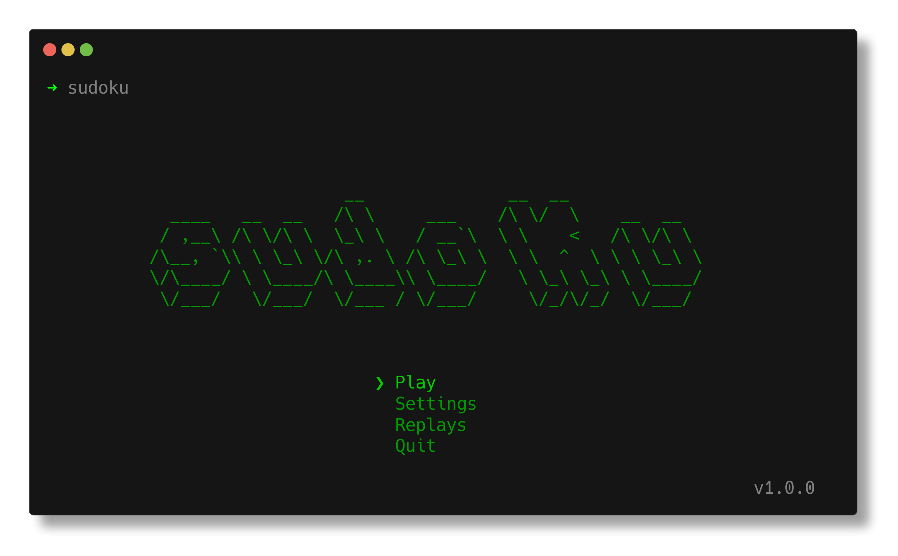
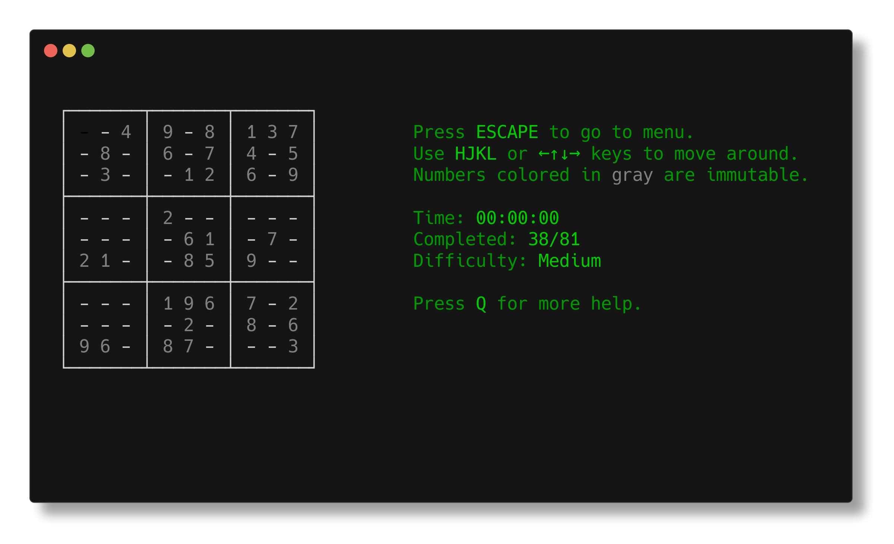

```sh
                   __              __  __
  ____   __  __   /\ \     ___    /\ \/  \    __  __  
 / ,__\ /\ \/\ \  \_\ \   / __`\  \ \    <   /\ \/\ \ 
/\__, `\\ \ \_\ \/\ ,. \ /\ \_\ \  \ \  ^  \ \ \ \_\ \
\/\____/ \ \____/\ \____\\ \____/   \ \_\ \_\ \ \____/
 \/___/   \/___/  \/___ / \/___/     \/_/\/_/  \/___/

# in terminal c:
```

# sudoku-in-terminal 

Sudoku game working entirely within your terminal window. 🧩\
Built with Typescript on top of [Ink](https://github.com/vadimdemedes/ink) and [React](https://github.com/facebook/react).



## ✨ Features

* Easy to navigate sudoku board using either arrow keys or `HJKL`.
* Solver for your current game.
* Automatically detects mistakes.
* 4 levels of difficulty.
* Customizable settings.
* Stores settings, unfinished games in a file.
* Many helpful keybindings.
* Game Replays.
* Supports terminals without unicode support.
* Interactive and responsive.

## 📝 Requirements

* Node 18 or above.
* NPM or an alternative package manager.

## 🚀 Getting Started

Use NPM (or package manager of your choice) to download the game as a global package on your system:

```sh
npm i sudoku-in-terminal -g
```

Now to start it, just type in the console:

```sh
sudoku
# You might need to prefix it with npx.
```



> For more information run the game in your command line.

## 🛫 Roadmap

- [ ] Add tests.
- [ ] Improve readability of the code.
- [ ] Add more JSDocs.
- [ ] Cache validator.
- [ ] Allow arrow keys with __CTRL__ to skip occupied cells.
- [ ] Improve replays.
- [ ] CLI flags.
- [ ] More options for creating sudoku game.
- [ ] Customizable keystrokes.
- [ ] Update cache file before exiting.

## Versioning

This project follows [Semantic Versioning](https://semver.org) (SemVer).

## License

This project is licensed under the Apache License 2.0. See the [LICENSE](./license) file for details.